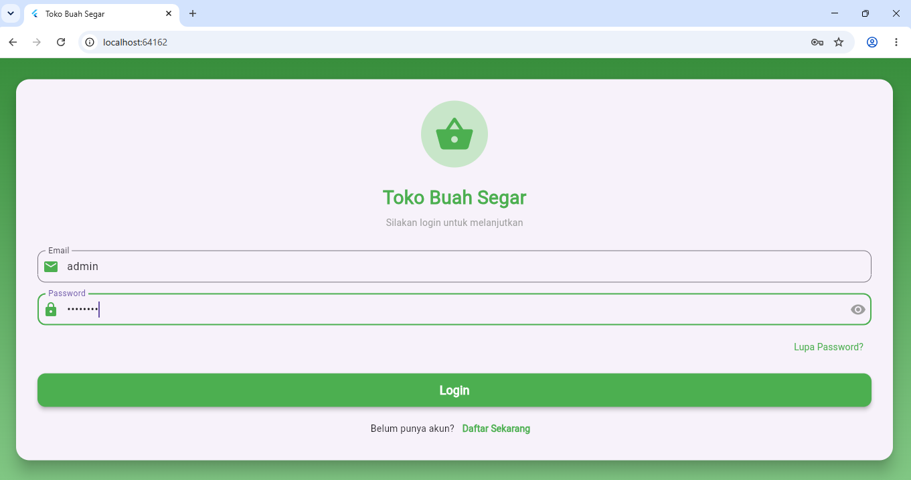
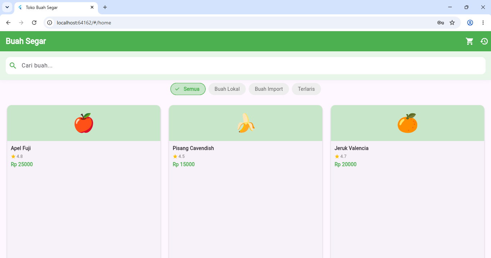
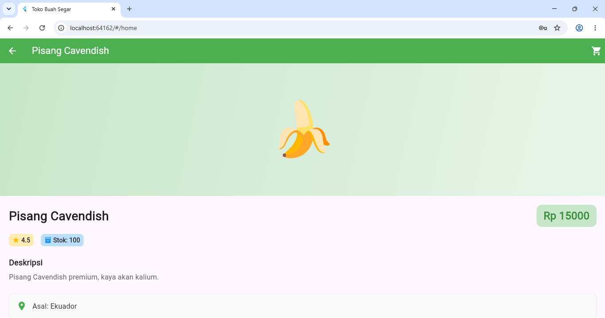
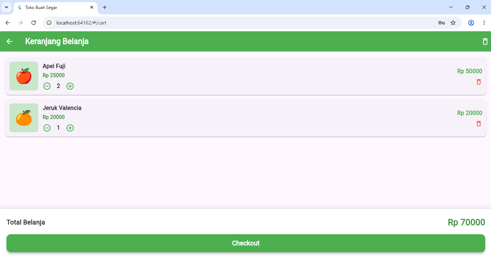
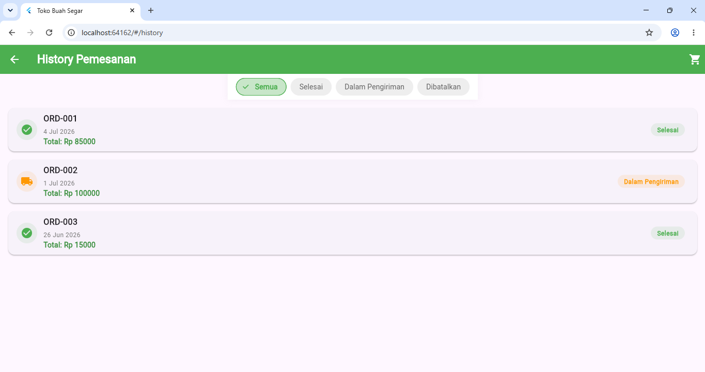

# fruit_store_app

## UAS Mobile Programming - Ahmad Al Hafis

A Flutter project for fruit store application.

## Getting Started

This project is a starting point for a Flutter application.

### Resources:
- https://docs.flutter.dev/get-started/learn-flutter
- https://docs.flutter.dev/get-started/codelab
- https://docs.flutter.dev/reference/learning-resources

## 📸 App Screenshots

### 🔐 Login Page

### 🍎 Daftar Buah (Fruit List)

### 📄 Detail Buah

### 🛒 Keranjang Belanja

### 📜 History Pemesanan

For help, visit:
https://docs.flutter.dev/
